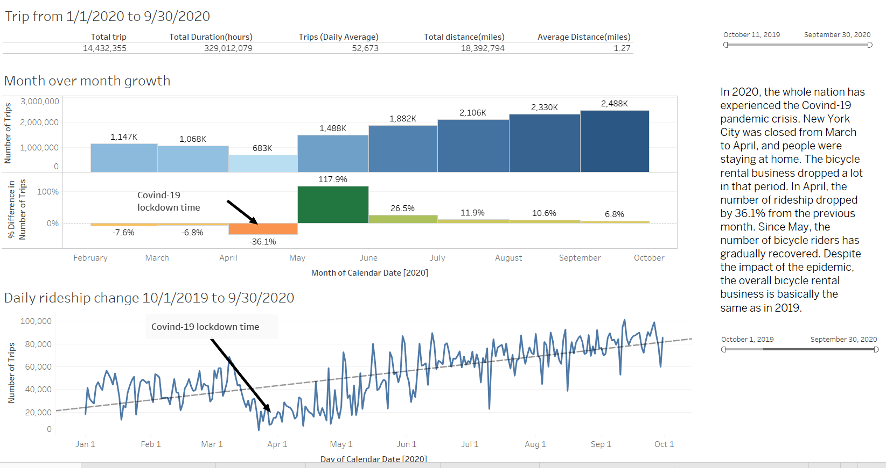

# Assignment - Citi Bike Analytics from Harry Xing 

**The Tableau story presentation url:**
https://public.tableau.com/profile/harry6771#!/vizhome/myhomework4/Story1?publish=yes

### Dashboard1 "rideship during pandemic“

* How many trips have been recorded total during the chosen period?

* By what percentage has total ridership grown?

### Dashboard2 How has the proportion of short-term customers and annual subscribers changed?

### Dashboard3 "Peaks"

* What are the peak hours in which bikes are used during summer months?

* What are the peak hours in which bikes are used during winter months?

### Dashboard4 "Top/Bottom Stations"

* Today, what are the top 10 stations in the city for starting a journey? (Based on data, why do you hypothesize these are the top locations?)

* Today, what are the top 10 stations in the city for ending a journey? (Based on data, why?)

* Today, what are the bottom 10 stations in the city for starting a journey? (Based on data, why?)

* Today, what are the bottom 10 stations in the city for ending a journey (Based on data, why?)

### Dashboar5 "Gender"

* Today, what is the gender breakdown of active participants (Male v. Female)?

* How effective has gender outreach been in increasing female ridership over the timespan?

### Dashboar5 "age and average distance"

* How does the average trip duration change by age?

* What is the average distance in miles that a bike is ridden?

### Dashboard6 "Bike Status Dashboard"

* Which bikes (by ID) are most likely due for repair or inspection in the timespan?

* How variable is the utilization by bike ID?

### Dashboard7 "Maps"

* **Basic:** A static map that plots all bike stations with a visual indication of the most popular locations to start and end a journey with zip code data overlaid on top.

* **Advanced:** A dynamic map that shows how each station's popularity changes over time (by month and year). Again, with zip code data overlaid on the map.

* The map you choose should also be accompanied by a write-up unveiling any trends that were noticed during your analysis.

Dashboard 8:  "Station pair map"

 

